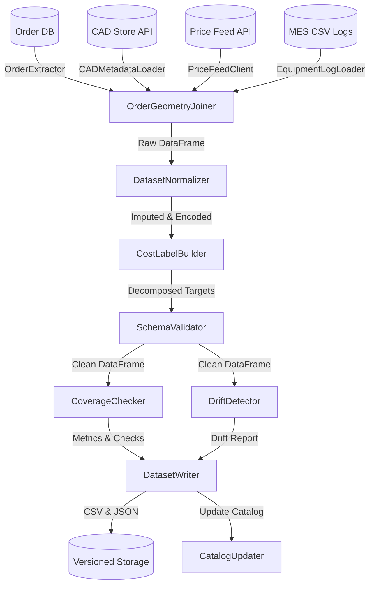

# ETL Data Pipeline Architecture

This document describes the architectural design, data flows, and component structure of the Matterize Manufacturing Data Pipeline.

## System Overview

The pipeline aggregates data from four disparate sources, structures it, normalizes features, decomposes costs, validates quality thresholds, and writes versioned datasets for model training.

## Core Components

### 1. Ingestion Layer (`src/ingestion/`)
- **`OrderExtractor`**: Pulls fulfilled orders and invoices from internal Postgres.
- **`CADMetadataLoader`**: Fetches pre-computed geometry feature vectors from the CAD store REST API.
- **`PriceFeedClient`**: Requests current daily commodity prices and appends them to a historical archive.
- **`EquipmentLogLoader`**: Loads weekly machine availability and hourly operator rates from MES CSV files.

### 2. Transformation Layer (`src/transforms/`)
- **`OrderGeometryJoiner`**: Joins files by `part_id` and dates. Performs left joins on orders, logging and filtering out rows where geometry is missing.
- **`DatasetNormalizer`**: Handles null imputation, cleans string fields, maps ordinal category indices, and builds interaction terms (`log_quantity`, `volume_x_price`).
- **`CostLabelBuilder`**: Applies process-specific cost splitting ratios when invoice breakdown details are missing.
- **`DatasetVersioner`**: Formats filenames and logs companion JSON metadata versioning files.

### 3. Validation Layer (`src/validation/`)
- **`SchemaValidator`**: Enforces column types and numeric ranges, dropping rows that fail rules.
- **`CoverageChecker`**: Counts samples per process class to verify dataset balance.
- **`DriftDetector`**: Computes Kolmogorov-Smirnov tests comparing feature distributions against the previous pipeline run.

### 4. Loader Layer (`src/loaders/`)
- **`DatasetWriter`**: Saves output files and automatically copies the latest datasets to `matterize-cost-model` and `cad-process-recommender` workspaces.
- **`CatalogUpdater`**: Registers the dataset version in a master index catalog.
